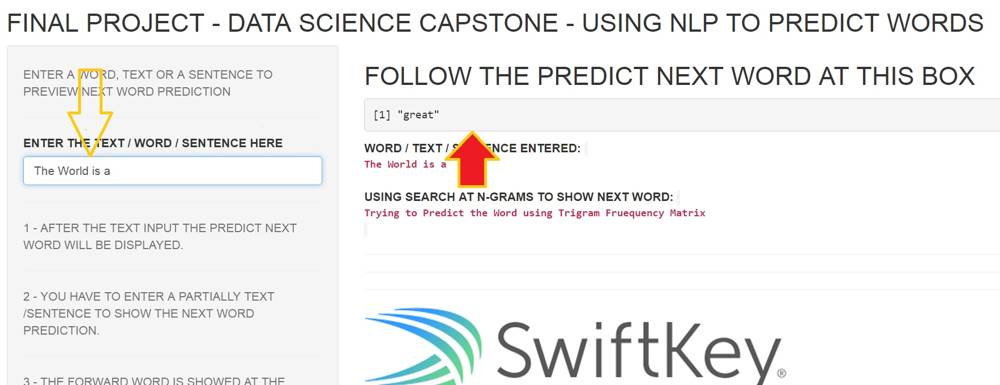

Coursera Data Science Capstone Project
========================================================
author: Biju Balachandran
date: June 2017
#autosize: true

* This Pitch is an application that uses Natural Language Processing techniques for predicting next word.
* The Shiny application can be visualized at the link: [data science application](https://bijub21.shinyapps.io/capstone/)
* The Capstone is a cooperation between Coursera and SwiftKey company.

OVERVIEW
========================================================

* The objective of this capstone is developing a Shiny app that can predict the next word, like that used in mobile keyboards applications implemented by the [Swiftkey](https://swiftkey.com/en).

* There are many tasks to be realized such as: (1) Understanding the problem, getting and cleaning the data;  (2) Making of Exploratory Data Analysis (EDA); (3) Tokenization of words and predictive text mining; (4) Writing a milestone project and a prediction model; (5) Developing a shiny application and Writing the Pitch.

* The data came from [HC Corpora](http://www.corpora.heliohost.org) with three files (Blogs, News and Twitter). The data was cleaned, processed, tokenized, and n-grams are created. The final report comes from the link [Milestone Report](http://rpubs.com/Bijub21/capstoneMidReport).

METHODS AND APPROACHING
========================================================
* After loaded the data, a sample was created, cleaned and prepared to be used as a corpus of text. It was converted to lower case, removed the punctuation, links, whitespace, numbers and profanity words.

* The sample text was "tokenized" into so-called n-grams to construct the predictive models (Tokenization is the process of breaking a stream of text up into words, phrases. N-gram is a contiguous sequence of n items from a given sequence of text).

* The n-grams files or data.frames (unigram, bigram, trigram and quadgram) are matrices with frequencies of words, used into the algorithm to predict the next word based on the text entered by the user.
 
THE SHINY APPLICATION
========================================================

* The Shiny application allow the prediction of the next possible word in a sentence. 

* The user entered the text in an input box, and in the other one, the application returns the most probability word to be used.

* The predicted word is obtained from the n-grams matrices, comparing it with tokenized frequency of 2, 3 and 4 grams sequences. 

* While entering the text, the field with the predicted next word refreshes instantaneously, and then the predicted word is then provided for the user's choice. 

THE APP USER INTERFACE
========================================================

* Screenshot of the user interface with the directions to provide a sentence or a word and get the prediction of the next likely word.

ADDITIONAL COMMENTS AND LINKS
========================================================

* Accuracy could be improved increasing the sample size. 

* The final report comes from the link [Milestone Report](http://rpubs.com/Bijub21/282010). 

* The next word prediction app is hosted on shinyapps.io: [Shiny app](https://bijub21.shinyapps.io/capstone/)

* This Pitch slide deck is located in RPubs at [Pitch Deck](http://rpubs.com/Bijub21/capstone-data-science-pitch)

* The whole code of this application, as well as all the milestone report, related scripts, this presentation, etc. can be found in this GitHub repo: [GitHub](https://https://github.com/bijub2110/CapstoneDatascienceProject)

